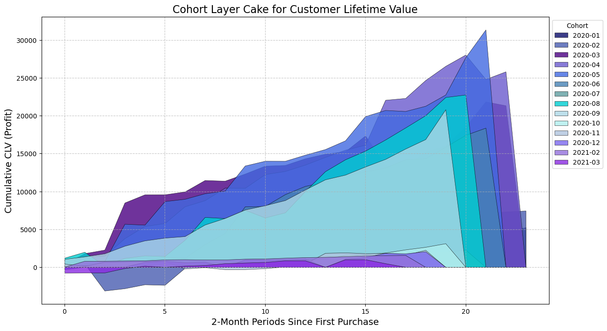
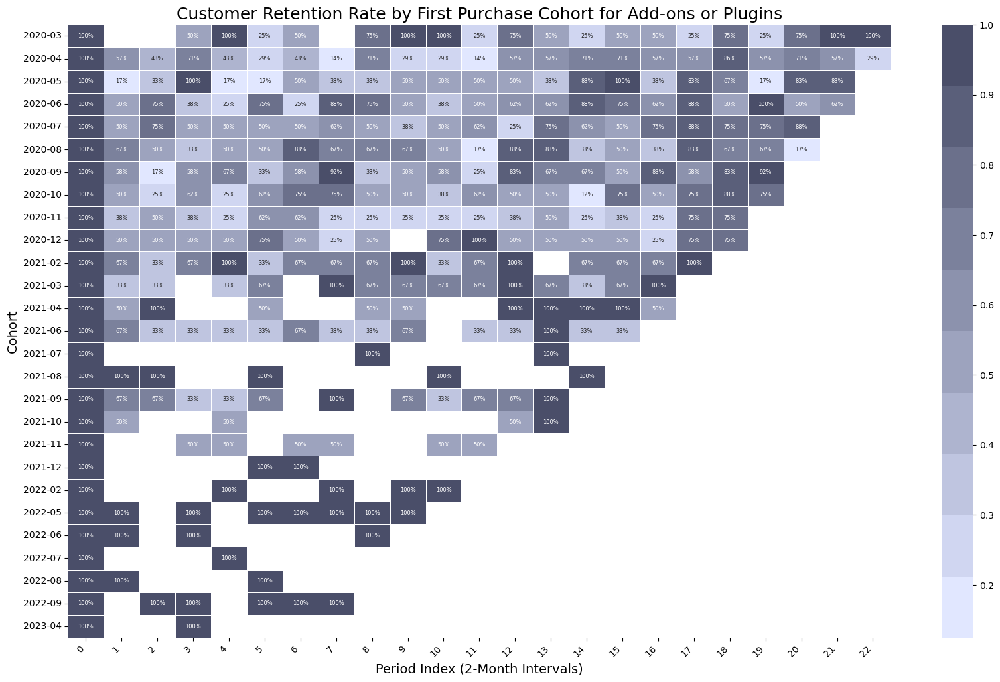
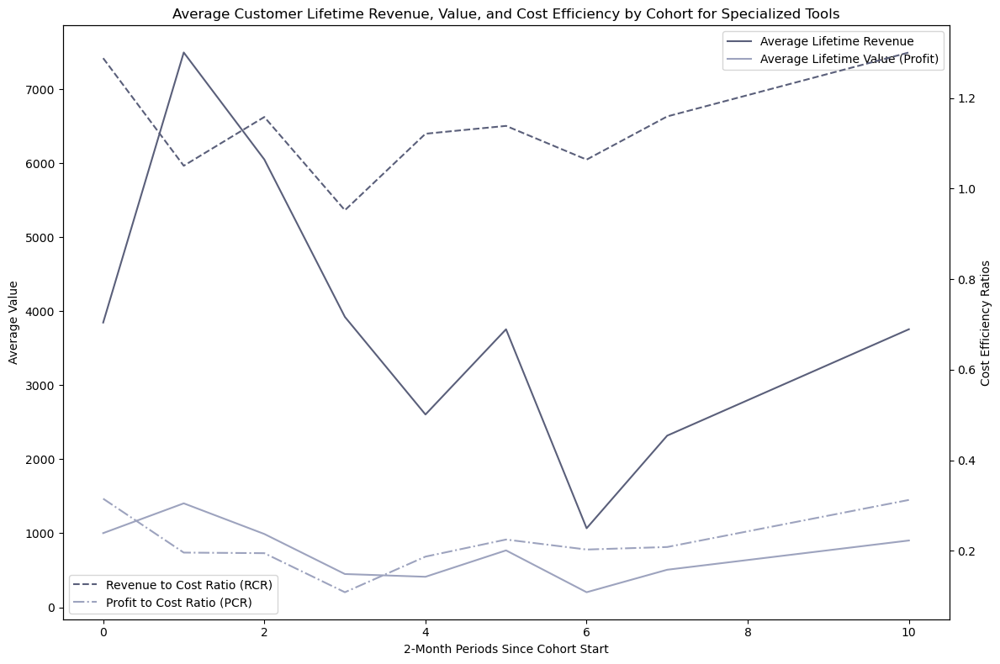
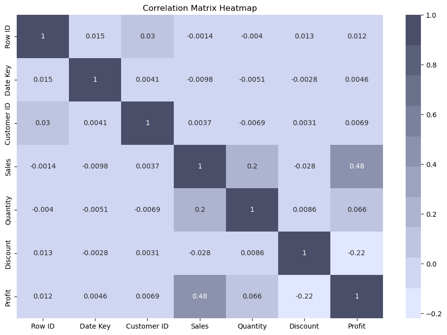

# SaaS Customer Segmentation and Cohort Analysis

## Executive Summary
This project analyzes over 5,000 SaaS sales transactions to perform a comprehensive cohort analysis, offering valuable insights into customer segmentation, retention, and revenue growth. By identifying key trends and strategic opportunities through the examination of first purchase dates and usage patterns, this analysis outlines a clear roadmap for improving customer retention and maximizing lifetime value, with projected increases of 10% in Gross Dollar Retention, 20% in CLV Growth, and 15% in Expansion MRR.

**Key Insights:**
- **Targeted Customer Segmentation:** Utilizing dynamic grouping based on purchase behavior and product usage, the analysis identifies key customer segments and tailors strategies to improve engagement and retention.
- **Cohort Performance Tracking:** Through the use of CRR, NRR, CLR, and CLV metrics, the project tracks retention and revenue trends over time, offering a deep understanding of customer behavior and profitability.
- **Strategic Recommendations:** The analysis generates actionable steps for both immediate and sustained growth, informed by data-driven insights that align with business objectives.
- **Cost Efficiency:** A detailed CLR vs. CLV analysis highlights the most profitable customer segments, helping to prioritize resources effectively.
- **Visual Insights:** Effective use of visualizations, such as cohort layer cakes and CLV comparisons, to clearly communicate findings and support strategic decisions.

**Impact:**
The analysis provides a roadmap for improving customer retention and maximizing lifetime value, with strategic recommendations that are projected to positively influence key business metrics, including Gross Dollar Retention, CLV Growth, and Expansion MRR.

**Demonstrated Skills:**
- **Advanced Data Analysis:** Expertise in extracting actionable insights from complex datasets, utilizing tools such as Python (Pandas) and Jupyter Notebooks.
- **Strategic Business Thinking:** Ability to align analytical insights with business goals, driving meaningful improvements in key performance indicators.
- **Effective Communication:** Strong proficiency in presenting data through clear visuals and concise, impactful recommendations.

This project showcases the ability to translate data into strategic actions that drive business success, making it a valuable asset for decision-making in the SaaS industry.

## Table of Contents
- [Technologies Used](#technologies-used)
- [Data Source](#data-source)
- [Business Question](#business-question)
- [Methodology](#methodology)
- [Process](#process)
- [Business Question Insights and Recommendations](#business-question-insights-and-recommendations)
- [Stakeholder Recommended Next Steps](#stakeholder-recommended-next-steps)
  	- [High Priority](#high-priority)
  	- [Medium Priority](#medium-priority)
  	- [Low Priority](#low-priority)
- [Recommendations for Further Analysis](#future-work)
- [Screenshots/Visual Examples](#screenshots)
- [Estimated Impact of Proposed Actions with Advanced SaaS Metrics and Cited Industry Benchmarks](#estimated-impact)
- [Conclusion](#conclusion)
- [Contact](#contact)

## Technologies Used
- **Anaconda Prompt:** Environment management and package installation.
- **Jupyter Notebooks:** Interactive environment for step-by-step documentation, data cleaning, and analysis.
- **Python (Version 3.11.4):** Core programming language for data analysis, with the following libraries:
	- **Pandas:** Data cleaning and manipulation.
    - **Numpy:** Numerical operations and data manipulation.
	- **Matplotlib & Seaborn:** Data visualization and plotting.
- **Kaggle:** Source of the dataset.
- **Git:** Version control for tracking changes and managing project history, with deployment to GitHub.

## Data Source
[This](https://www.kaggle.com/datasets/nnthanh101/aws-saas-sales) dataset includes customer transaction data from a fictitious SaaS company selling software B2B. The dataset includes columns such as Order ID, Order Date, Customer ID, Product, Sales, and Profit.

## Business Question
**"How effective have recent customer acquisition and engagement strategies been in increasing Customer Lifetime Value (CLV), and what impact do cohort-specific factors, such as promotions and market conditions, have on the financial performance of different customer segments over time?"**

## Methodology
This project conducts a detailed cohort analysis, segmented by first purchase dates and hypothesized product usage groups, to derive actionable insights into **customer engagement**, retention, and revenue generation. Customer segmentation allows us to categorize customers into distinct groups based on their purchasing behavior and product usage, enabling a more tailored analysis of trends and patterns within each segment.

**Cohort analysis** is employed as it tracks the performance of these customer segments over time, making it the most effective method to understand how different strategies impact long-term customer value and to identify the factors influencing retention and revenue. This approach is crucial for answering the business question, as it reveals both immediate and evolving customer behaviors that drive profitability.

The analysis focuses on the following key metrics:

- **Customer Retention Rate (CRR):** Measures the percentage of customers within each cohort who continue making purchases over subsequent periods, providing insights into customer loyalty and the effectiveness of retention strategies.
- **Net Revenue Retention (NRR):** Evaluates the percentage of recurring revenue retained from existing customers over a specified period, accounting for upsells, downsells, and churn, offering a comprehensive view of revenue stability and growth.
- **Customer Lifetime Revenue (CLR):** Calculates the total revenue generated by a customer throughout their relationship with the business, helping to identify high-value customer segments.
- **Customer Lifetime Value (CLV):** Estimates the total profit expected from a customer over their entire relationship with the business, guiding strategic decisions on customer acquisition and retention investments.

## Process
1. **Data and Libraries Import and Loading:** Imported necessary Python libraries, including pandas, numpy, seaborn, and matplotlib. Loaded the dataset containing customer transactions and product details, ensuring all relevant columns were correctly parsed and formatted for analysis.
2. **Exploratory Data Analysis (EDA):** Conducted an initial exploration of the dataset to understand its structure, identify missing values, and detect any anomalies. Generated descriptive statistics and visualizations to gain insights into customer behavior, product performance, and overall sales trends.
3. **Customer Segmentation:** Defined products and their respective definitions based on hypothesized usage groups. Segmented the customer base into distinct groups according to these definitions, enabling more targeted analysis of product usage patterns and customer behaviors.
4. **Hypothesized Usage Group Validation:** Validated the hypothesized usage groups through statistical analysis and visualization. Ensured that the segmentation accurately reflected distinct patterns in customer behavior, allowing for more meaningful cohort analysis.
5. **Cohort Analysis:** Performed cohort analysis by calculating and analyzing key metrics such as Customer Retention Rate (CRR), Net Retention Rate (NRR), Customer Lifetime Revenue (CLR), and Customer Lifetime Value (CLV) both overall and within each usage group. Assessed CLR vs. CLV cost efficiency to determine the profitability of each cohort.
6. **Cohort Layer Cake:** Created a cohort layer cake visualization to illustrate the cumulative CLV over time, both overall and for each usage group. This visualization helped identify patterns in customer value contribution across different cohorts and highlighted the impact of specific customer acquisition and retention strategies.
7. **Business Question Specific Insights and Recommendations:** Synthesized findings from the EDA, cohort analysis, and cohort layer cake into a cohesive set of results to answer the business question. Identified key trends, insights, and conclusions regarding customer behavior, product performance, and financial outcomes.
8. **General Cohort Analysis Insights and Stakeholder Recommendations:** Developed actionable recommendations from general insights for stakeholders, segmented into immediate, mid-term, and long-term priorities. These recommendations were prioritized based on their potential impact and urgency, with a focus on enhancing customer engagement, optimizing financial performance, and driving long-term growth.
9. **Recommendations for Further Analysis:** Proposed additional analyses to build on the current findings, including churn prediction, advanced customer journey mapping, sentiment analysis, and strategic pricing evaluation. These recommendations aimed to provide deeper insights and support continuous improvement in customer management strategies.

## Business Question Insights and Recommendations
1. **Effectiveness of Recent Customer Acquisition and Engagement Strategies:**
- **Observation:** The analysis shows a steady rise in cumulative Customer Lifetime Value (CLV) for newer cohorts, indicating that recent customer acquisition and engagement strategies have been effective. The quick initial rise in CLV for most cohorts underscores strong early engagement and suggests that the strategies employed are successfully attracting and retaining customers in the initial stages.
- **Recommendation:** To maintain and enhance this positive trend, it is recommended to continue focusing on early-stage engagement strategies. Specifically, consider refining onboarding processes, improving the first-touch experience, and offering personalized promotions early in the customer journey. Additionally, leveraging data-driven insights to identify and replicate successful elements of these strategies across all customer segments can ensure consistent results.
2. **Impact of Cohort-Specific Factors on Financial Performance:**
- **Observation:** Variability in growth among different cohorts, especially in mid-2020, suggests that cohort-specific factors such as the timing of customer acquisition campaigns, market conditions, or promotional activities significantly impact the financial performance of customer segments. Some cohorts, particularly from late 2020 and early 2021, exhibited sharp increases in CLV during mid-to-late periods, likely due to effective periodic promotions or re-engagement strategies.
- **Recommendation:** To optimize the financial performance across all cohorts, it's crucial to conduct a detailed analysis of the external and internal factors affecting each cohort. This could involve A/B testing different marketing strategies, timing promotions based on seasonal trends, or tailoring re-engagement strategies to specific customer segments. Additionally, continuously monitor market conditions and adjust acquisition strategies to mitigate potential negative impacts on customer value.
3. **Financial Risk in Specialized Tools and Later Cohorts:**
- **Observation:** The analysis reveals sharp declines and even negative CLV values in some later cohorts, particularly concerning specialized tools. This suggests that certain products or customer segments may be experiencing financial losses or increased costs, potentially due to higher acquisition costs or ineffective engagement strategies in these areas.
- **Recommendation:** To mitigate financial risks, it is recommended to conduct a thorough review of the cost structure and profitability of specialized tools. Implementing tighter cost controls, refining the pricing strategy for these tools, and closely monitoring their performance can prevent further declines. Additionally, identifying underperforming cohorts early and applying targeted interventions can help recover lost value.
4. **Importance of Continuous Customer Acquisition and Retention Efforts:**
- **Observation:** The layered effect observed in the cohort layer cake charts highlights the incremental value brought by each new cohort over time. This underscores the critical importance of maintaining continuous customer acquisition and retention efforts to sustain growth in overall CLV.
- **Recommendation:** To ensure ongoing success, it is recommended to invest in scalable customer acquisition channels and develop robust retention programs that engage customers throughout their lifecycle. This might include loyalty programs, personalized communication, and data-driven insights to predict and prevent churn. Continuously innovating and testing new acquisition and retention strategies will be key to maintaining momentum in CLV growth.
5. **Optimizing Customer Segmentation and Engagement:**
- **Observation:** The cohort analysis emphasizes the value of advanced customer segmentation and targeted engagement strategies. By understanding the unique behaviors and needs of different customer segments, the business can tailor its approach to maximize CLV.
- **Recommendation:** Utilize clustering algorithms and machine learning models to segment customers more effectively based on behavior, preferences, and value. This will enable personalized marketing efforts, improve targeting for retention and upselling campaigns, and ultimately enhance the profitability of each segment. Regularly updating and refining these segments will ensure that marketing efforts remain relevant and effective as customer behaviors evolve.

## Stakeholder Recommended Next Steps

### High Priority

**Optimize Customer Segmentation and Engagement**
- **Action:** Improve customer segmentation and targeted engagement strategies to maximize CLV.
- **Specific Steps:**
  - Implement clustering algorithms and machine learning models to segment customers based on behavior, preferences, and value.
  - Tailor personalized marketing efforts and retention campaigns to each segment.
  - Regularly update and refine customer segments to ensure marketing efforts remain relevant.

**Maintain and Enhance Early-Stage Engagement Strategies**
- **Action:** Continue focusing on early-stage engagement strategies to sustain the positive trend in Customer Lifetime Value (CLV) for new cohorts.
- **Specific Steps:**
  - Refine onboarding processes to ensure a seamless first-touch experience.
  - Offer personalized promotions early in the customer journey to boost initial engagement.
  - Leverage data-driven insights to identify and replicate successful engagement elements across all customer segments.

**Invest in Continuous Customer Acquisition and Retention**
- **Action:** Sustain overall CLV growth by maintaining robust customer acquisition and retention efforts.
- **Specific Steps:**
  - Invest in scalable customer acquisition channels.
  - Develop loyalty programs and personalized communication strategies to engage customers throughout their lifecycle.
  - Innovate and test new acquisition and retention strategies continuously to maintain momentum in CLV growth.

### Medium Priority

**Conduct Detailed Analysis of Cohort-Specific Factors**
- **Action:** Optimize financial performance by analyzing external and internal factors affecting cohort growth.
- **Specific Steps:**
  - Conduct A/B testing of different marketing strategies to determine the most effective approaches.
  - Time promotions based on seasonal trends to maximize impact.
  - Tailor re-engagement strategies to specific customer segments to improve cohort performance.

### Low Priority

**Mitigate Financial Risks in Specialized Tools and Later Cohorts**
- **Action:** Address financial risks by reviewing cost structures and refining strategies for underperforming products and cohorts.
- **Specific Steps:**
  - Conduct a thorough review of the cost structure and profitability of specialized tools.
  - Refine the pricing strategy for these tools to improve profitability.
  - Monitor performance closely and apply targeted interventions to recover lost value in underperforming cohorts.

## Recommendations for Further Analysis
To further refine insights and enhance actionable outcomes, consider pursuing the following steps:
1. **Churn Prediction and Root Cause Analysis:** 
- Develop a churn prediction model to proactively identify customers at risk.
- Conduct root cause analysis to understand factors driving churn and develop specific interventions.
2. **Advanced Customer Journey Mapping:** 
- Map out the customer journey in more detail to pinpoint key touchpoints and potential pain points, enabling more targeted engagement strategies.
- Enhance customer engagement at each stage to drive retention and increase long-term value.
3. **Customer Feedback and Sentiment Analysis:** 
- Perform sentiment analysis on customer feedback to identify trends and areas for improvement.
- Establish a continuous feedback loop to ensure customer needs are met and satisfaction remains high.
4. **Strategic Pricing Analysis:** 
- Evaluate current pricing models and discount strategies to optimize revenue and profitability.
- Analyze price sensitivity and elasticity to inform dynamic pricing strategies that align with customer value perceptions.

## Screenshots/Visual Examples

## Estimated Impact of Proposed Actions with Advanced SaaS Metrics and Cited Industry Benchmarks**

- **Gross Dollar Retention (GDR):** Estimated **10%** increase through strategic retention strategies. *(Supported by KeyBanc Capital Markets, 2021; Bessemer Venture Partners, 2020)*

- **Customer Lifetime Value (CLV) Growth Rate:** Estimated **20%** increase via enhanced cross-selling, upselling, and engagement strategies. *(Supported by SaaS Capital, 2021; OpenView Partners, 2020)*

- **Expansion MRR:** Estimated **15%** increase through targeted upsell and cross-sell opportunities. *(Supported by Pacific Crest Securities, 2020; McKinsey & Company, 2021)*

## Conclusion
This project highlights my ability to perform in-depth cohort analysis and deliver actionable insights that directly influence business strategy and growth. By analyzing customer behavior through segmentation and retention metrics, I identified key opportunities to optimize customer lifetime value and drive significant improvements in business performance, including projected increases of 10% in Gross Dollar Retention, 20% in CLV Growth, and 15% in Expansion MRR.

Key takeaways include:
- **Strategic Insight:** The analysis provided clear, data-driven recommendations that align with business goals, focusing on both immediate actions and long-term growth strategies, with tangible impacts on key metrics like Gross Dollar Retention and CLV.
- **Analytical Expertise:** Demonstrated proficiency in using advanced data techniques to uncover meaningful trends and patterns, contributing to more informed decision-making.
- **Effective Communication:** Successfully translated complex data into clear, actionable insights, supported by impactful visualizations that convey the story behind the data.

This project exemplifies my commitment to driving business value through data analysis, strategic thinking, and effective communication. I am eager to bring these skills to a dynamic team where I can continue to contribute to data-driven success!

## Contact
For more information, please contact:

**Name:** Matt Delaune

**Email:** matt.delaune@gmail.com
